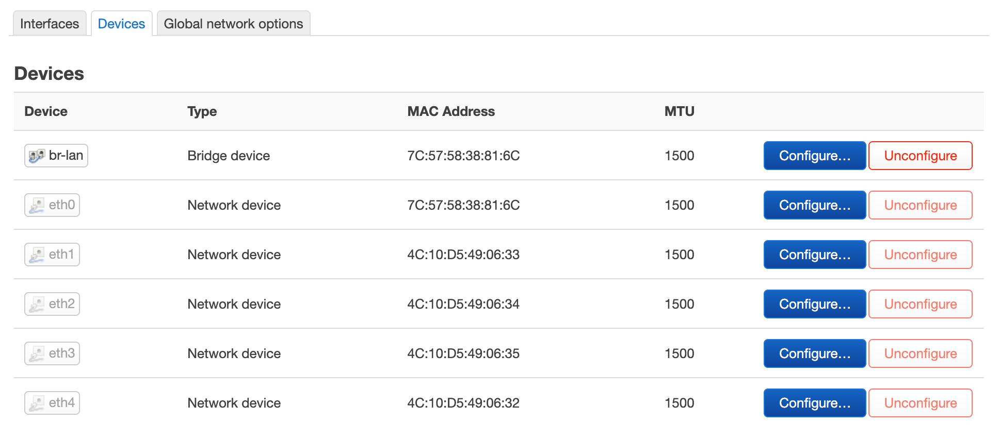
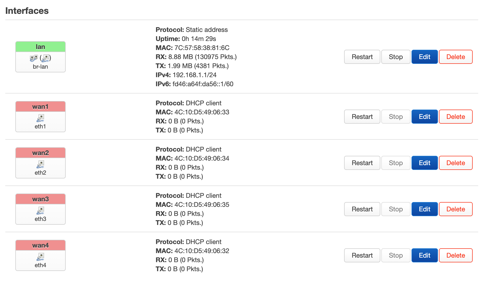
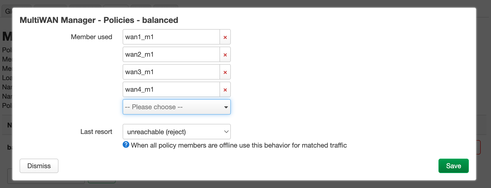
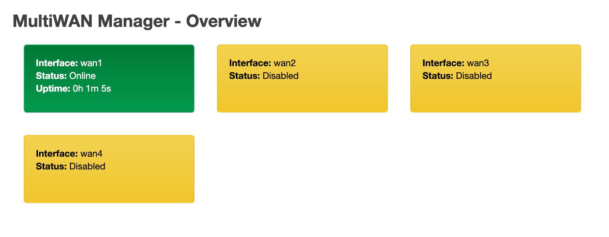
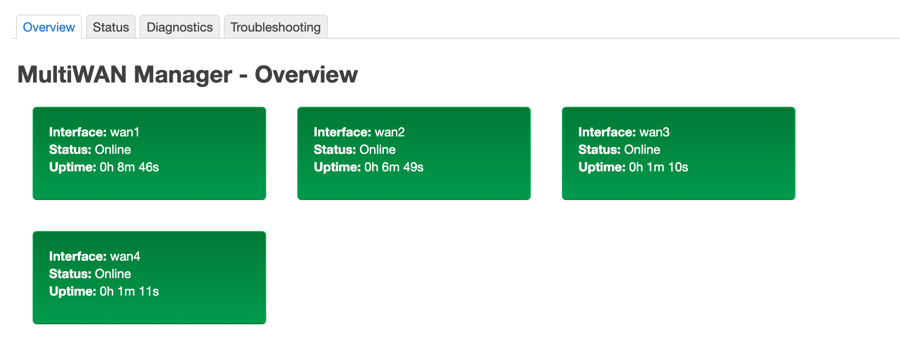

## Origin

Tragic story


## Write Image

Using official OpenWRT, x86\_64 build. Download link is [here](https://downloads.openwrt.org/releases/24.10.0/targets/x86/64/)!

Pick any Linux distribution's LiveCD to write the image to disk. Since this machine is ready just to serve as a router, no partition expansion has been done.

Write to disk:

```bash
gunzip -c openwrt-24.10.0-x86-64-generic-squashfs-combined-efi.img.gz | sudo dd of=/dev/nvme0n1 bs=4M status=progress
```

Restart to enter OpenWRT boot, change the default password, connect the computer to the `eth0` interface of the router machine (in this case, it's the onboard network port), enable DHCP, and after getting the IP, access 192.168.1.1 to enter the LuCI interface.

In Interfaces - Devices, you can see all the network interfaces, no extra drivers need to be installed, OpenWRT has built-in support for this network card.



## WAN Configuration

First, remove the default WAN port configuration and prepare to assign all four ports of this network card as WAN.

Go to the Interfaces tab, delete the original wan and wan6 ports, and apply the settings once:


Click Add new interface to create a new WAN port, repeat this action four times, name the interfaces wan1\~wan4, corresponding devices should be chosen as eth1\~eth4.

There are two points to note in Advanced Settings:

* In Advanced Settings, `Use gateway metric` should be set as 10/20/30/40 respectively.
  * This is very important! Incorrectly setting the metric will cause wan gateway rules to overshadow each other (?), resulting in connection failure.
  * Reference: [mwan3 documentation](https://openwrt.org/docs/guide-user/network/wan/multiwan/mwan3#configure_a_different_metric_for_each_wan_interface)
* In Firewall Settings, set `Assign firewall-zone` to wan and allocate the interface to wan.

Save and apply:



At this point, connect one of the cables to wan1 and test the network connectivity.

If the computer cannot access the internet (or the router can access the internet but the computer can't), try restarting the router.

## Load Balancing Configuration

Next, set up mwan3 load balancing, this package requires additional installation.

Replace Tuna image source:

```bash
sed -i 's_https\?://downloads.openwrt.org_https://mirrors.tuna.tsinghua.edu.cn/openwrt_' /etc/opkg/distfeeds.conf

opkg update
```

Install mwan3 and luci control panel:

```bash
opkg install mwan3 luci-app-mwan3
```

Re-enter LuCI and go to Network - MultiWAN Manager, delete all built-in Interface, Member, except the balanced Policy, delete all others, remove https in the rule, and apply the settings once.


Use the input box at the bottom left of the page to add interfaces again:

* Named wan1\~wan4 respectively
* Check the `Enabled` checkbox
* If confident in network quality (i.e., the line should be plug-and-play most of the time), select Online for `Initial state`. Otherwise, select Offline.
* Set `Tracking hostname or IP address` to baidu.com or another preferred site
* Detection interval and tolerance can be adjusted based on estimation of line quality


After adding interfaces, create a Member for each one, name them wan1\_m1\~wan4\_m1. In the detailed settings, `metric` is the connection priority, the lower the value, the higher the priority; `weight` is the load-sharing weight, recommended to configure according to the bandwidth ratio of different lines. Since all four lab internal network lines are 100M, the default value (all 1) is chosen here.


Finally, modify the `balanced` Policy and fill in `Member used` with all the members created in the previous step.



Other content doesn't need modification; click apply settings, then go to Status - MultiWAN Manager, four configured load balancing interfaces should be visible, with wan1 showing Online.



Next, connect the remaining cables to wan2\~wan4 port:



After confirming that each interface status is normal and can access the internet normally, connect the subordinate router to the eth0 port, configure DHCP properly, and it's ready to use.

## Standard Ending


