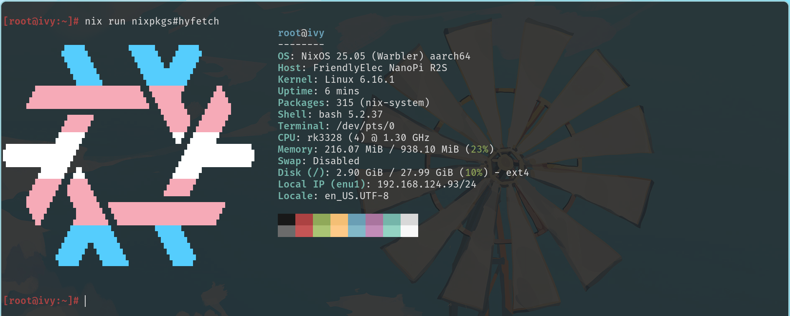

Noa has a NanoPi R2S at hand.

Previously, it was hanging at the home network exit serving as a soft router, running OpenWRT + OpenClash, but because it was really unstable (random crashes) and it mysteriously slowed down DNS resolution, it was taken down to gather dust.

Until a few days ago, Noa suddenly wanted to play DN42... hoping to run it at home for convenience, but lacked a device to serve as a persistently online server (the previous PVE mini host was requisitioned by me for use as a desktop computer), so the idea arose to use the R2S. Since I’m more familiar with and prefer NixOS over OpenWRT, I first need to figure out how to make some modifications to the R2S.

## Preparation

Information about the R2S can be found [here](https://wiki.friendlyelec.com/wiki/index.php/NanoPi_R2S/zh), Rockchip RK3328 CPU, using u-boot to boot.

For Rockchip chips, you can learn about their boot process [here](https://opensource.rock-chips.com/wiki_Boot_option):

1. BootROM loading (firmware)
2. BootROM loads idbloader.img (TPL/SPL), initializes DDR, and loads u-boot
3. u-boot searches for valid boot methods (when booting Linux, [Extlinux Bootmeth](https://docs.u-boot.org/en/latest/develop/bootstd/extlinux.html#extlinux-bootmeth) can be used)
4. u-boot loads the initrd/kernel image based on the contents of `extlinux.conf` and boots


```md
+------------+--------------+--------------+---------------+---------------------------+
| Boot phase | Terminology  | Program name | RK image name | Image location            |
+------------+--------------+--------------+---------------+---------------------------+
| 1          | Primary      | ROM code     | BootRom       |                           |
|            | Program      | Loader       |               |                           |
+------------+--------------+--------------+---------------+---------------------------+
| 2          | Secondary    | U-Boot       | idbloader.img | 0x40                      | pre-loader
|            | Program      | TPL/SPL      |               |                           |
|            | Loader (SPL) |              |               |                           |
+------------+--------------+--------------+---------------+---------------------------+
| 3          | -            | U-Boot       | u-boot.itb    | 0x4000                    | u-boot + ATF
|            |              |              | uboot.img     |                           | only used with miniloader
|            |              | ATF/TEE      | trust.img     | 0x6000                    | only miniloader
+------------+--------------+--------------+---------------+---------------------------+
| 4          | -            | kernel       | boot.img      | 0x8000                    |
+------------+--------------+--------------+---------------+---------------------------+
| 5          | -            | rootfs       | rootfs.img    | 0x40000                   |
+------------+--------------+--------------+---------------+---------------------------+
```

## Configure binfmt

Configure [binfmt](https://search.nixos.org/options?channel=unstable&query=boot.binfmt.emulatedSystems) in the NixOS Configuration on the build machine to support building `aarch64-linux` products.

```nix
boot.binfmt.emulatedSystems = [ "aarch64-linux" ];
```

## Prepare NixOS configuration

Following the principle of getting the system up and running before messing with other services, Noa prepared a minimal NixOS system configuration ([system configuration](https://github.com/AsterisMono/flake/blob/e66d2bc4b2a87cf0b8ca61fd5e1326f7163d6c36/nixosConfigurations/ivy.nix), [hardware configuration](https://github.com/AsterisMono/flake/blob/794719e2df37a5bbcc5e2340cce7a4b0f244ccd7/hardwares/ivy.nix)).

Heavily (chao) referenced (xi) from [EHfive's flake](https://github.com/EHfive/flakes), thank you! Please check the original configuration upstream too~

## Package/Write U-boot

nixpkgs provides the `buildUBoot` function ([source](https://github.com/NixOS/nixpkgs/blob/master/pkgs/misc/uboot/default.nix), [documentation](https://wiki.nixos.org/w/index.php?title=U-Boot&mobileaction=toggle_view_desktop)):

```nix
{
  buildUBoot,
  armTrustedFirmwareRK3328,
  lib,
}@args:
# Taken from: https://github.com/EHfive/flakes/blob/main/packages/uboot-nanopi-r2s/default.nix
let
  armTrustedFirmwareRK3328 = args.armTrustedFirmwareRK3328.overrideAttrs (_: {
    NIX_LDFLAGS = "--no-warn-execstack --no-warn-rwx-segments";
    enableParallelBuilding = true;
  });
in
buildUBoot {
  defconfig = "nanopi-r2s-rk3328_defconfig";
  extraPatches = [
    ./expand-kernel-image-addr-space.patch
  ];
  extraMeta.platforms = [ "aarch64-linux" ];
  BL31 = "${armTrustedFirmwareRK3328}/bl31.elf";
  enableParallelBuilding = true;
  filesToInstall = [
    "u-boot.itb"
    "idbloader.img"
    "u-boot-rockchip.bin"
  ];
}
```

```console
❯ nix build .#packages.aarch64-linux.uboot-nanopi-r2s.default
❯ ls result/
.r--r--r-- 127k nobody  1 1 月   1970 idbloader.img
.── dr-xr-xr-x    - nobody  1 1 月   1970 nix-support
.r--r--r-- 9.4M nobody  1 1 月   1970 u-boot-rockchip.bin
.r--r--r-- 995k nobody  1 1 月   1970 u-boot.itb
```

Write idbloader.img to the 0x40 position, and u-boot.itb to the 0x4000 position:

```console
❯ sudo dd if=idbloader.img of=/dev/sda seek=64 conv=notrunc,fsync
126976 bytes (127 kB, 124 KiB) copied, 0.00459187 s, 27.7 MB/s
❯ sudo dd if=u-boot.itb of=/dev/sda seek=16384 conv=notrunc,fsync
994816 bytes (995 kB, 972 KiB) copied, 0.250188 s, 4.0 MB/s
```

## Partition

Use `fdisk` for partitioning, the first partition as `/boot`, reserving 512MB, and the remaining space as root. Since [u-boot supports ext4](https://u-boot.org/blog/filesystems-in-u-boot/), we won’t use vfat here:

```console
❯ sudo fdisk /dev/sda

Welcome to fdisk (util-linux 2.41.1).
Changes will remain in memory only, until you decide to write them to disk.
Use the write command wisely.

Command (type m for help): n
Partition number (1-128, default  1):
First sector (2048-61067230, default 2048): 32768
Last sector, +/-sectors or +size{K,M,G,T,P} (32768-61067230, default 61065215): +512M

Created a new partition 1 of type 'Linux filesystem' and of size 512 MiB.

Command (type m for help): n
Partition number (2-128, default  2):
First sector (2048-61067230, default: 1081344):
Last sector, +/-sectors or +size{K,M,G,T,P} (1081344-61067230, default 61065215):

Created a new partition 2 of type 'Linux filesystem' and of size 28.6 GiB.

Command (type m for help): w
Partition table has been altered.
Calling ioctl() to re-read partition table.
Syncing disks.

❯ sudo mkfs.ext4 -L NIXOS_BOOT /dev/sda1

❯ sudo mkfs.ext4 -L NIXOS_SD /dev/sda2
```

## Install Nix Store

The normal process at this point is to mount `NIXOS_SD` to `/mnt`, `NIXOS_BOOT` to `/mnt/boot`, and then use `nixos-install` to install the system. However, when operating this way, it was found that if you use `--store /mnt` to specify the store location during the `nix build` step, some drv builds fail:

```console
❯ sudo nix build .#nixosConfigurations.ivy.config.system.build.toplevel --store /mnt
error: builder for '/nix/store/yyap2m1f7dx00my9k8axhlxnc0wza1ha-builder.pl.drv' failed with exit code 255
error: builder for '/nix/store/ip8pwb70j7lxggx5dmaajk0iz6v7gg6w-chfn.pam.drv' failed with exit code 255
error: builder for '/nix/store/qxibnq8vvmg69m61rmzn2hml7651r5pj-mounts.sh.drv' failed with exit code 255
error: 1 dependencies of derivation '/nix/store/i69z3q24hvadgsm48vk3zgkl38mx6ghf-nixos-system-ivy-25.05.20250817.48f4c98.drv' failed to build
```

It is speculated that simulating the aarch64 structure using `binfmt` for building caused some mysterious compatibility issues. Finally, a workaround strategy of local build followed by `nix copy` to the target store was adopted.

```console
❯ sudo nix copy --to /mnt ./result --no-check-sigs
❯ sync
❯ sudo nix store info --store /mnt
Store URL: local
Version: 2.28.4
Trusted: 1
```

:::caution

Attempting to use f2fs on the root partition previously ended in failure.

```console
❯ sync
❯ sudo nix store info --store /mnt
error: executing SQLite statement 'pragma synchronous = normal': disk I/O error, disk I/O error (in '/mnt/nix/var/nix/db/db.sqlite`)
```

:::

## Install Bootloader

Some issues were encountered with the Bootloader installation, `nixos-install` automatic installation reported an error:

```console
❯ sudo nixos-install --flake /home/cmiki/Projects/flake#ivy --root /mnt --verbose --show-trace --no-root-passwd
building the flake in git+file:///home/cmiki/Projects/flake?ref=refs/heads/main&rev=12a02d8069985cdd5d7b3a0977c3b57f6254d363...
evaluating file '<nix/derivation-internal.nix>'
installing the boot loader...
chroot: failed to run command ‘/nix/var/nix/profiles/system/activate’: No such file or directory
chroot: failed to run command ‘/nix/var/nix/profiles/system/sw/bin/bash’: No such file or directory
```

It seems like a chroot issue; since `boot.generic-extlinux-compatible.enable = true` was already specified in the NixOS configuration, `nixos-rebuild` after getting into the system is likely to generate the boot configuration correctly. Consider manually installing the kernel and initrd during the bootstrap stage and handwriting an `extlinux.conf`.

The position of init can be safely hardcoded here because the next rebuild will update and replace it.

```console
❯ nix build .#nixosConfigurations.ivy.config.system.build.toplevel
❯ sudo install -Dm644 "$(readlink -f result/kernel)" /mnt/boot/Image
❯ sudo install -Dm644 "$(readlink -f result/initrd)" /mnt/boot/initrd
❯ sudo install -Dm644 result/dtbs/rockchip/rk3328-nanopi-r2s.dtb /mnt/boot/rk3328-nanopi-r2s.dtb

❯ ls nix/store/crzbn8gb8c1gs54wdw2kgizxmwp1pq0i-nixos-system-ivy-25.05.20250817.48f4c98/init
.r-xr-xr-x 4.4k root  1 1 月   1970 nix/store/crzbn8gb8c1gs54wdw2kgizxmwp1pq0i-nixos-system-ivy-25.05.20250817.48f4c98/init

❯ sudo mkdir -p /mnt/boot/extlinux
❯ sudo touch /mnt/boot/extlinux/extlinux.conf
```

```conf
DEFAULT NixOS
TIMEOUT 1
LABEL NixOS
    KERNEL /Image
    INITRD /initrd
    FDT /rk3328-nanopi-r2s.dtb
    APPEND console=ttyS2,1500000 earlycon=uart8250,mmio32,0xff130000 root=LABEL=NIXOS_SD rootfstype=ext4 rootwait init=/nix/store/crzbn8gb8c1gs54wdw2kgizxmwp1pq0i-nixos-system-ivy-25.05.20250817.48f4c98/init
```

Finally, check the layout of `/boot` and re-run `nixos-install` with `--no-bootloader`:

```console
❯ tree /mnt/boot
/mnt/boot
├── extlinux
│   └── extlinux.conf
├── Image
├── initrd
└── rk3328-nanopi-r2s.dtb

❯ sudo nixos-install --flake /home/cmiki/Projects/flake#ivy --root /mnt --verbose --show-trace --no-bootloader --no-root-passwd
building the flake in git+file:///home/cmiki/Projects/flake...
evaluating file '<nix/derivation-internal.nix>'
installation finished!
```

## Power Up

And so it’s up and running~



:::note

In EHfive's [original configuration](https://github.com/EHfive/flakes/blob/5ce77ec77db5ec2d14e29a9b0a8db46282569595/machines/r2s/hardware.nix#L136), two indicator LEDs were configured to custom network interfaces.

You can generally first configure them to real devices (WAN as `end0`, LAN as `enu1`).

([Why not eth0/eth1?](https://www.freedesktop.org/wiki/Software/systemd/PredictableNetworkInterfaceNames/))

:::

## Next Tasks...

* [ ] Configure ext4 filesystem parameters for root to care for SD card longevity
* [ ] Write a derivation that can package a flashable SD Image, like the previously done kukui-nixos
* [ ] Configure automatic updates for the flake system
* [ ] Play around with DN42 using this small machine
