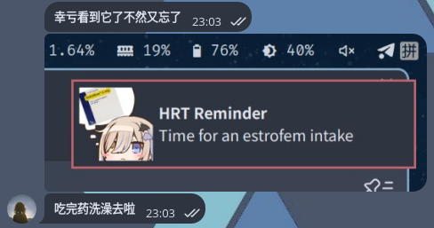

## Too Many Medications to Take!

After several trips back and forth to Wuhan Liu Jiao Ting + multiple purchases through illegal channels (shh), Noa now regularly takes the following medications:

### Related to HRT

* [Estrofem (Estradiol)](https://mtf.wiki/zh-cn/docs/medicine/estrogen/estradiol), taken sublingually 3 times a day (7:00/15:00/23:00), totaling 6mg
* [Androcur (Cyproterone)](https://mtf.wiki/zh-cn/docs/medicine/antiandrogen/cyproterone), taken every other day, 12.5mg each time

### Premium Medications

* [Escitalopram ~~~(Lu Zheng's Happy Pills)~~~](https://zh.wikipedia.org/wiki/%E8%89%BE%E5%8F%B8%E8%A5%BF%E9%85%9E%E6%99%AE%E5%85%B0), 15mg (1.5 tablets) once daily
* [Lorazepam](https://zh.wikipedia.org/zh-hans/%E5%8A%B3%E6%8B%89%E8%A5%BF%E6%B3%AE), 0.5mg (0.5 tablets) twice daily. ~~~Helps me sleep, not sure why I'm required to take it in the morning~~~
* [Mirtazapine](https://zh.wikipedia.org/wiki/%E7%B1%B3%E6%B0%AE%E5%B9%B3), prescribed but not currently taken to avoid overburdening the liver

### Supplements

* Vitamin B, 2 tablets 3 times a day. Said to prevent depression caused by Androcur, but seemingly ineffective
* Vitamin C, taken as desired to maintain some level of immunity

:::caution

I secretly sweat at the thought of how long this can go on...

:::

:::note

Each of these medications plays a role:

🩷 Estrofem (Estradiol): A part of your body, shaping you into who you wish to be, it's a gentle form of magic.

🩶 Androcur (Cyproterone): A barrier that blocks voices that don't belong to you.

🩵 Escitalopram: Repairs deep neural circuits, helping you gradually reclaim color and rhythm.

💤 Lorazepam: Comforts you during the most chaotic and painful moments, allowing you to sleep a bit.

:::

## Can't Remember Which Medications to Take!

Initially, when I only needed to take Estrofem and Androcur, my brain, as a small four-legged furry creature, barely remembered the schedule (though taking Androcur every other day caused significant confusion...)

Until last week, when I went to Liu Jiao Ting for more premium medications due to severely unstable sleep, I could no longer rely on memory to manage my medication... The number of missed doses began to increase, particularly forgetting the Escitalopram and the afternoon dose of Estrofem, almost reverting back to male several times (


So I wanted a small tool to remind myself to take medications on time. But after looking around, only a few options seemed feasible:

* Alarms, too noisy. *And completely lacks a sense of ceremony*
* Sticky notes on the monitor. *Might work initially, but eventually ignored*
* "Reminders" or similar to-do management apps. *Not particularly friendly for highly regular events and I rarely check my phone*
* Dedicated medication reminder apps. *Good ones require payment, free ones are not very useful*

Then it occurred to me: Noa is in front of a computer all day. Maybe there's a way to send persistent reminders on the computer?

### Crontab

First instinct was Crontab scheduled tasks +`notify-send`.

But Crontab can only be set at the system level, and [others](../lyra-and-noa/) on this machine clearly don't need Noa's type of medication reminders... Although user identity can be specified, the Crontab settings would inherently fall into the system's scope, not the user's scope, requiring NixOS Module management instead of Home Module. Not preferable.

### systemd.timer

Asked Lyra if there were any other options for user scope:


:::note

systemd.timer is a task scheduling mechanism provided by systemd which can replace traditional cron at both user and system levels.

By creating a .timer unit paired with a service unit, you can set a specific time cycle to automatically trigger tasks, like popping up notifications daily or running a script.

Compared to cron, systemd.timer supports natural language expressions for time (like OnCalendar=*-*-\* 09:00 indicates 9 AM daily) and can work with Persistent=true to catch up missed tasks after a power outage, making it very suitable for quiet and reliable reminders.

:::

## Let's Write Some Nix

Dedicated to the lifelong pursuit of Pure and Reproducible, a Nix fanatic can never handwrite systemd units! It's absolutely impossible!

Here, we can use two configs provided by home-manager: [`systemd.user.services`](https://home-manager-options.extranix.com/?query=systemd.user.services\&release=release-25.05) and [`systemd.user.timers`](https://home-manager-options.extranix.com/?query=systemd.user.timers\&release=release-25.05). Their syntax is almost the same as native systemd unit syntax without much mapping modification, just write the config part directly.

```nix
config = {
  systemd.user = {
    services = ?;
    timers = ?;
  };
};
```

Here are two question marks to fill in, their content should derive from the final values of options. There should be sufficient options in the options to configure multiple reminder timers, including setting reminder time and triggering reminder content (command). Let's write a generator placeholder here:

```nix
config = {
  systemd.user = {
    services = generateSystemdServices cfg;
    timers = generateSystemdTimers cfg;
  };
};
```

Next, define the reminder options. Writing as a submodule allows the outer option definition to use `type = with types; attrsOf (submodule reminderOpts)`, designing the reminder option interface as an attrset.

```nix
reminderOpts = _: {
  options = {
    OnCalendar = mkOption {
      example = [ "*-*-* 4:00:00" ];
      type = with types; listOf str;
    };
    ExecStart = mkOption {
      example = ''
        notify-send "Hello world!"
      '';
      type = types.str;
    };
  };
};
```

The corresponding outer option can be written like this:

```nix
options = {
  noa.reminders = mkOption {
    example = {
      "estrofem-intake" = {
        OnCalendar = [ "*-*-* 15:00:00" ];
        ExecStart = ''
          notify-send -u critical -i /home/cmiki/Pictures/estrofem.png "HRT Reminder" "Time for an estrofem intake"
        '';
      };
    };
    type = with types; attrsOf (submodule reminderOpts);
  };
};
```

Finally, implement the two generator implementations. For systemd syntax, this is not difficult, but make sure to use helper functions in `lib.attrset` to avoid reinventing the wheel.

:::tip

Useful lib functions for Noa:

* Handling attrset and submodules: `lib.attrValues`, `lib.mapAttrs`, `lib.mapAttrs'`, `lib.nameValuePair`, `lib.concatMapAttrs` (paired with self-written merge)
* Handling strings: `lib.hasSuffix/Prefix`, `lib.removeSuffix/Prefix`, `lib.concatStringsSep`, `lib.concatLines`, `lib.splitString`
* Optionals series: `lib.optionals`, `lib.optionalAttrs`, `lib.optionalString`
* Lists: `lib.head`
* Debugging: `lib.traceVal`

:::

```nix
generateSystemdServices =
  reminderAttrs:
  lib.mapAttrs' (
    name: value:
    lib.nameValuePair "reminder-${name}" {
      Unit = {
        Description = "Reminder service for ${name}";
      };
      Service = {
        Type = "oneshot";
        inherit (value) ExecStart;
      };
    }
  ) reminderAttrs;
```

```nix
generateSystemdTimers =
  reminderAttrs:
  lib.mapAttrs' (
    name: value:
    lib.nameValuePair "reminder-${name}" {
      Unit = {
        Description = "Reminder timer for ${name}";
      };
      Install = {
        WantedBy = [ "timers.target" ];
      };
      Timer = {
        inherit (value) OnCalendar;
      };
    }
  ) reminderAttrs;
```

Make sure the service and unit are of the same name, so they automatically associate without specifying `Unit` in the timer.

## Import Module and Apply Configuration

Intend to use `notify-send` to send cute persistent notifications!

As Noa uses Mako's default configuration, notifications don't randomly disappear, they stay at the top-right of the screen until dismissed.

In the home-manager configuration, write:

```nix
let
  # From "spirit pollution" sticker pack
  getReminderIcon = filename: "${assetsPath}/reminder-icons/${filename}";
  notify-send = lib.getExe' pkgs.libnotify "notify-send";
in
{
  imports = [ ./options.nix ];

  noa.reminders = {
    "estrofem-intake" = {
      OnCalendar = [
        "*-*-* 07:00:00"
        "*-*-* 15:00:00"
        "*-*-* 23:00:00"
      ];
      ExecStart = ''
        ${notify-send} -u critical -i ${getReminderIcon "estrofem.png"} "HRT Reminder" "Time for an estrofem intake"
      '';
    };
  }
}
```

This creates a new cute desktop scheduled notification reminder. The effect is:


The reminder effect is quite good, currently on the second day of using it, it's already saved me twice (



Module source code can be found here: [https://github.com/AsterisMono/flake/tree/main/homeModules/apps/reminder](https://github.com/AsterisMono/flake/tree/main/homeModules/apps/reminder)
