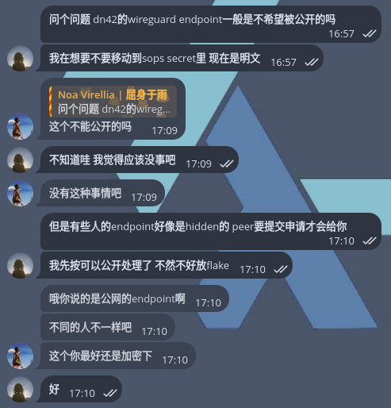

## 天崩开局

前两天 Noa 在设置 DN42（这篇文章还没有写呢！怠惰！），用 NixOS Configuration 做了个持久化可复现配置，随手把朋友的 peer tunnel public endpoint 写到了 .nix 文件里。

大概是长 [这样](https://github.com/AsterisMono/flake/commit/38c370aa480ac673b0c5555f28083aae44a30fec) 的：


就这样相安无事地过了两周。

直到某天，我在快乐 peering 的时候，突然想到一件很可怕的事情：wg peer tunnel endpoint 好像是某些人的家宽公网 IPv6... 这样公开真的没问题吗？

遂询问~~银趴头子~~ [Cryolitia](https://github.com/Cryolitia)：



瞬间感觉天塌了，因为这些 endpoint 数据已经在我的仓库里存活了两周，并且还经历了至少 2 个 Pull Request（

怎么办怎么办！加密数据一定还会导致配置重构，但是现在已经没时间考虑这些了～我需要想个办法把大家的盒（？）从 Git 历史和 GitHub 的所有角落清除掉🤔

## BFG Repo-Cleaner to the rescue

首先要处理 git 仓库历史里的信息。这里可以使用 [BFG Repo-Cleaner](https://rtyley.github.io/bfg-repo-cleaner/) 扫描整个 git object database 然后干掉/替换掉其中不想要的内容（问就是业务熟练，之前小时候不懂事往 repo 里放过会被 DMCA 的材料）

:::tip

[BFG Repo-Cleaner](https://rtyley.github.io/bfg-repo-cleaner/) 是一个快速清理 Git 仓库历史的工具，可以用来移除误提交的大文件或敏感信息。

相比 git filter-branch，它操作更简单、速度更快，适合用来给仓库“瘦身”或删除不该保留在历史里的内容。

:::

### 克隆纯仓库

```console
❯ git clone --mirror https://github.com/AsterisMono/flake flake-bfg
克隆到纯仓库 'flake-bfg'...
remote: Enumerating objects: 6385, done.
remote: Counting objects: 100% (583/583), done.
remote: Compressing objects: 100% (117/117), done.
remote: Total 6385 (delta 504), reused 488 (delta 465), pack-reused 5802 (from 3)
接收对象中：100% (6385/6385), 65.82 MiB | 806.00 KiB/s, 完成。
处理 delta 中：100% (3709/3709), 完成。
```

### 清除机密信息

这里可以提前把不想要出现的信息写入一个文本文件，每个一行。BFG Repo-Cleaner 会自动将需要处理的文本替换成 `***REMOVED***`。

```console
❯ , bfg --replace-text '/home/cmiki/Projects/flake/clear.txt' flake-bfg

Using repo : /home/cmiki/Projects/flake-bfg

Found 133 objects to protect
Found 17 commit-pointing refs : HEAD, refs/heads/feat/encrypt-peers, refs/heads/main, ...

Protected commits
-----------------

These are your protected commits, and so their contents will NOT be altered:

 * commit 3b7a0e08 (protected by 'HEAD') - contains 1 dirty file :
        - nixosModules/services/dn42.nix (10.5 KB)

WARNING: The dirty content above may be removed from other commits, but as
the *protected* commits still use it, it will STILL exist in your repository.

Details of protected dirty content have been recorded here :

/home/cmiki/Projects/flake-bfg.bfg-report/2025-09-19/21-58-53/protected-dirt/

If you *really* want this content gone, make a manual commit that removes it,
and then run the BFG on a fresh copy of your repo.

Cleaning
--------

Found 1284 commits
Cleaning commits:       100% (1284/1284)
Cleaning commits completed in 189 ms.

Updating 6 Refs
---------------

        Ref                             Before     After
        ---------------------------------------------------
        refs/heads/feat/encrypt-peers | a64ee71f | d6d2d3d5
        refs/heads/main               | 3b7a0e08 | 0783547a
        refs/pull/10/head             | ebe6249a | 87325bf1
        refs/pull/12/head             | 841bb42e | ad1f16bf
        refs/pull/13/head             | 9b4597d2 | 2a3ec8a8
        refs/pull/14/head             | a64ee71f | d6d2d3d5

...Ref update completed in 7 ms.

Commit Tree-Dirt History
------------------------

        Earliest                                              Latest
        |                                                          |
        .....................................................DDDDDDD

        D = dirty commits (file tree fixed)
        m = modified commits (commit message or parents changed)
        . = clean commits (no changes to file tree)

                                Before     After
        -------------------------------------------
        First modified commit | 585c53e7 | 34e2c950
        Last dirty commit     | 972f0f8e | 863ad3a6

Changed files
-------------

        Filename        Before & After
        -------------------------------------------------------------
        dn42.nix      | 4df9ef15 ⇒ 08173ad0, 0aa5ca1a ⇒ e6c0b5bd, ...
        dn42Peers.nix | cffbe5fa ⇒ e6817da3
        ivy.nix       | c8d5ebc1 ⇒ 0da6b2c1, 82a020d3 ⇒ eac08e03, ...
        options.nix   | dcb45556 ⇒ 8ca7c77a

In total, 299 object ids were changed. Full details are logged here:

        /home/cmiki/Projects/flake-bfg.bfg-report/2025-09-19/21-58-53

BFG run is complete! When ready, run: git reflog expire --expire=now --all && git gc --prune=now --aggressive
❯ cd flake-bfg
❯ git reflog expire --expire=now --all && git gc --prune=now --aggressive
枚举对象中：6388, 完成。
对象计数中：100% (6388/6388), 完成。
使用 16 个线程进行压缩
压缩对象中：100% (6120/6120), 完成。
写入对象中：100% (6388/6388), 完成。
Selecting bitmap commits: 1237, 完成。
Building bitmaps: 100% (117/117), 完成。
总共 6388（差异 3758），复用 2402（差异 0），包复用 0（来自  0 个包）
```

### 推送回上游

```console
❯ git push
枚举对象中：6388, 完成。
写入对象中：100% (6388/6388), 65.69 MiB | 5.87 MiB/s, 完成。
总共 6388（差异 0），复用 0（差异 0），包复用 6388（来自  1 个包）
remote: Resolving deltas: 100% (3758/3758), done.
To https://github.com/AsterisMono/flake
 + a64ee71...d6d2d3d feat/encrypt-peers -> feat/encrypt-peers (forced update)
 + 3b7a0e0...0783547 main -> main (forced update)
 ! [remote rejected] refs/pull/1/head -> refs/pull/1/head (deny updating a hidden ref)
 ! [remote rejected] refs/pull/10/head -> refs/pull/10/head (deny updating a hidden ref)
 ! [remote rejected] refs/pull/11/head -> refs/pull/11/head (deny updating a hidden ref)
 ! [remote rejected] refs/pull/12/head -> refs/pull/12/head (deny updating a hidden ref)
 ! [remote rejected] refs/pull/13/head -> refs/pull/13/head (deny updating a hidden ref)
 ! [remote rejected] refs/pull/14/head -> refs/pull/14/head (deny updating a hidden ref)
 ! [remote rejected] refs/pull/2/head -> refs/pull/2/head (deny updating a hidden ref)
 ! [remote rejected] refs/pull/3/head -> refs/pull/3/head (deny updating a hidden ref)
 ! [remote rejected] refs/pull/4/head -> refs/pull/4/head (deny updating a hidden ref)
 ! [remote rejected] refs/pull/5/head -> refs/pull/5/head (deny updating a hidden ref)
 ! [remote rejected] refs/pull/6/head -> refs/pull/6/head (deny updating a hidden ref)
 ! [remote rejected] refs/pull/7/head -> refs/pull/7/head (deny updating a hidden ref)
 ! [remote rejected] refs/pull/8/head -> refs/pull/8/head (deny updating a hidden ref)
 ! [remote rejected] refs/pull/9/head -> refs/pull/9/head (deny updating a hidden ref)
错误：无法推送一些引用到 'https://github.com/AsterisMono/flake'
```

被处理过的纯仓库在推送时会更新远程上的所有 refs。这里可以看到一些被拒绝更新的 ref，它们是什么呢？

根据这个 [Issue](https://github.com/rtyley/bfg-repo-cleaner/issues/484) 的讨论：

> From my understanding this is because GitHub/GitLab still has references to the old commits in any pull requests.
>
> Even though BFG has rewritten the commits, GitHub still has read-only refs for the old commits in pull requests.

GitHub 会对每个 Pull Request 里的 commit 保留只读副本，这部分副本以 refs 的形式存在于仓库里，即使强制推送也是不可写入的，没办法毁尸灭迹。

很不巧的是，我 DN42 部分的配置就是用 Pull Request 合入的（于是只能求助 GitHub Support

## 请求 GitHub Support 移除 Pull Request

:::note

前提是，目标必须是你（或你所在组织）控制的仓库中的内容，才可以发起删除请求。

:::

[GitHub 支持（为什么这个网站有中文？）](https://support.github.com/) -> 我的工单 -> 新工单 -> 从我拥有或控制的存储库中删除数据 -> 删除拉取请求

这里会遇到一个很好玩的虚拟代理（看起来像 LLM 但不是 LLM 的机器人），会提问你以下几个问题：

* 需要移除的 PR 数量？是单个还是多个？
* 要从哪个仓库进行移除？移除哪几个 PR（PR 号码）？
* 有没有从 git history 里清除掉敏感数据（这个我们已经做完了）？或者，受影响的机密信息有没有已经 rotate？
* 清除 git history 和 rotate/expire 敏感数据是否已经解决了你的问题？
* （如果没有）为什么你需要彻底移除这个 PR？

填写结束之后会直接创建一个 Support Ticket，完全不需要再写小作文了，体验非常好。


:::caution

GitHub Support **不支持** Firefox。

虽然他们没说不支持，也没有提示不支持，但是虚拟代理和一般的提交工单按钮都是**用不了的**。

:::

GitHub Support Staff 响应速度很快，一般十分钟之内就会回复你的 ticket，要你额外提交一些最初引入敏感数据的 commit hash，这样他们可以执行额外的扫描，确保你的敏感数据从 GitHub 永久消失：

> If you are trying to remove a sensitive commit from GitHub, and that commit is referenced anywhere else, such as in another pull request, branch or tag, it won't be garbage collected after I delete the pull request.
>
> Before I delete the pull requests, can you find the full SHA of the commit that originally introduced the sensitive data? I can then run a thorough check to make sure it is not referenced anywhere and we can successfully remove it from GitHub.
>
> \[...] If you don't provide me with a SHA, I can proceed with deleting the pull request, but I can't guarantee that any sensitive commits will be successfully garbage collected away.

提供 SHA 之后 staff 会工作一小会，然后告诉你已经用提供的 SHA 扫描了 PR 引用，一般来说扫描出的引用和你要删的 PR 是一致的。接下来会给你两个选择：

* 彻底删除整个 Pull Request，包括对话、Review 和文件 diff
* 只删除文件引用，会移除文件 diff，但是可以保留 PR 里的对话历史

我的仓库只有我一个人在用，所以放心大胆地选了直接删除。如果是社区项目可能会考虑下第二个选项。

再过一会就会发现你指定的 PR 神秘消失了，使用带编号的链接打开也会显示 404。

> Alright! I’ve deleted the PRs and performed cache clearance and garbage collection on the repository.
>
> Have a great weekend, and feel free to reach out again if you need anything else!

这下终于可以睡好觉了，不用担心群友因为我的 public 仓库被开盒了（

## 所以之后呢？要加密的数据怎么办？

长久以来在 Nix Configuration 里加密数据的推荐方法只有一个：`sops-nix`。

也许还有 `agenix`，但这两个解决方案有一个共同点：都是运行时解密，在 eval 时没办法、也不可能释放出明文给配置。

而 `dn42Peers.nix` 保存的 peer 信息在很多机器的配置上都有使用，被嵌入了很多 NixOS Module 的 config，这些 config 并不都支持 secret template override。即使都能做到支持，改造成本也非常大。

所以最后（耻辱地）选择了用 [git-agecrypt](https://github.com/vlaci/git-agecrypt) 对这个文件做 git 层面的加密。引原项目曰：

> Why should I use this?
>
> Short answer: you probably shouldn't.
>
> \[...] The one use-case where it makes sense to use git-agecrypt instead is when you want to keep some files secret on a (potentially public) git remote, but you need to have the plaintext in the local working tree because you cannot hook into the above tools for your workflow. Being lazy is not an excuse to use this software.

代价是系统闭包之后不再能被 public binary cache host。而且会感觉系统闭包脏了（被 secrets 污染了...）

并不是一个很完美的解决方案。或许后面再想想吧？
